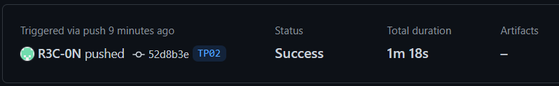

# TP 2

### 2-1 What are testcontainers?

There are containers used to launch every app tests

### 2-2 Document your Github Actions configurations.

**main.yml**

```yml
name: CI devops 2023
'on':
  # For each push on branch TP02 launch github Action
  push:
    branches: TP02
    # Do nothing on pull request
  pull_request:

jobs:
  test-backend:
    runs-on: ubuntu-22.04
    steps:
      #checkout your github code using actions/checkout@v2.5.0
      - uses: actions/checkout@v2.5.0

      #do the same with actions/setup-java that enable to setup jdk 17
      - name: Set up JDK 17
        uses: actions/setup-java@v3.9.0
        with:
          distribution: corretto
          java-version: '17'

      #finally build your app with the latest command
      - name: Build and test with Maven
        run: mvn clean verify --file ./backend-api/app/pom.xml
```

**Execution**



**docker build and push**

```yaml
# define job to build and publish docker image
build-and-push-docker-image:
  # run only when code is compiling and tests are passing
  needs: test-backend
  environment: devops-tp02
  runs-on: ubuntu-22.04

  # steps to perform in job
  steps:
    - name: Checkout code
      uses: actions/checkout@v2.5.0

    # Login with docker login action
    - name: Docker Login
      uses: docker/login-action@v2.1.0
      with:
        username: ${{secrets.DOCKER_USER}}
        password: ${{secrets.DOCKER_PWD}}

    # Then we will build every images with the same method/action
    - name: Build image and push backend
      uses: docker/build-push-action@v3
      with:
        # relative path to the place where source code with Dockerfile is located
        context: ./backend-api
        # Note: tags where the image is pushed
        tags: ${{secrets.DOCKER_USER}}/tp01-backend
        # Push if github.ref (the branch updated) is equal to 'refs/heads/TP02'
        push: ${{ github.ref == 'refs/heads/TP02' }}

    - name: Build image and push database
      uses: docker/build-push-action@v3
      with:
        context: ./database
        tags: ${{secrets.DOCKER_USER}}/tp01-database
        push: ${{ github.ref == 'refs/heads/TP02' }}

    - name: Build image and push httpd
      uses: docker/build-push-action@v3
      with:
        context: ./http-server
        tags: ${{secrets.DOCKER_USER}}/tp01-httpd
        push: ${{ github.ref == 'refs/heads/TP02' }}
```

### Document your quality gate configuration.

**New secret on Github**

```
SONAR_TOKEN
XXXXXXXXXXXXXXXXXXXXXXX
```

**Workflow**

```yaml
[ ... ]
- name: Sonar Cloud
  run: mvn -B -e verify sonar:sonar -Dsonar.projectKey=R3C-0N_devops -Dsonar.organization=r3c-0n -Dsonar.host.url=https://sonarcloud.io -Dsonar.login=${{ secrets.SONAR_TOKEN }}  --file ./backend-api/app/pom.xml
  [ ... ]
```

**backend/app/pom.xml**

```xml

<properties>
    <sonar.organization>r3c-0n</sonar.organization>
    <sonar.host.url>https://sonarcloud.io</sonar.host.url>
</properties>
```

## Bonus: split pipelines

To split Pipelines we have to use "on.workflow_run" and separate each jobs in different Workflow

**build-and-push**

```yaml
workflow_run:
  branches:
    - develop # branch must be default branch
  # Workflow Run Event. Only trigger the workflow if the previous run was successful.
  types: [ completed ]
  # Only trigger the workflow for workflow run of `CI devops 2023`
  workflows: [ CI devops 2023 ]
```

